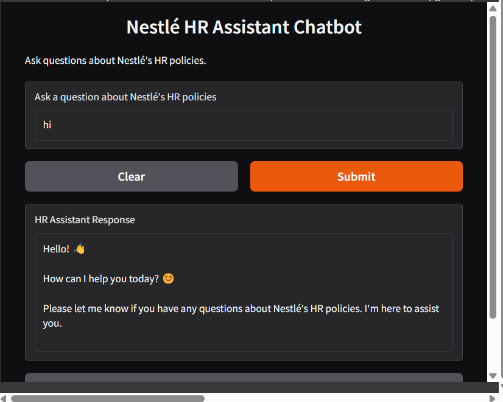

# Nestlé HR Assistant Chatbot

This repository provides a chatbot designed to assist with HR-related queries using Python, Gradio, and Groq API.

## Installation Guide

### 1. Install Python
Ensure you have Python installed on your system. If not, download and install the latest version from the [official Python website](https://www.python.org/). During installation, select the option to add Python to your system's PATH.

### 2. Create a Virtual Environment (Recommended)
To isolate dependencies and avoid conflicts, create a virtual environment:

Open a terminal or command prompt and navigate to your project directory. Then, execute:

```sh
python -m venv .venv
```

#### Activate the Virtual Environment:
- **Windows:**
  ```sh
  .venv\Scripts\activate
  ```
- **macOS/Linux:**
  ```sh
  source .venv/bin/activate
  ```

### 3. Install Dependencies
Create a `requirements.txt` file in your project directory and add the following dependencies:

```
chromadb
pypdf
groq
gradio
langchain-community
sentence-transformers
```

Install them using pip:

```sh
pip install -r requirements.txt
```

### 4. Download the HR Policy PDF
Download the `Nestlé HR Policy` PDF file (`nestle_hr_policy.pdf`) and place it in the same directory as your Python script.

### 5. Obtain a Groq API Key
To use the Groq API, you need an API key. Sign up on the [Groq website](https://www.groq.com/) and generate an API key.

Replace the placeholder API key in your code with the actual key:

```python
API_KEY = "your_actual_api_key_here"
```

### 6. Run the Code
Save the provided Python script as `hr_chatbot.py` and execute it in your terminal (ensure your virtual environment is activated):

```sh
python hr_chatbot.py
```

### 7. Access the Chatbot Interface
Once the script is running, a Gradio interface will launch. Look for the local URL displayed in the terminal (e.g., `http://127.0.0.1:7860/`) and open it in your web browser to interact with the chatbot.

## Important Considerations
- **Firewall/Antivirus:** Ensure your firewall or antivirus software is not blocking the Gradio interface from running or accessing the internet.
- **Troubleshooting:** If you encounter issues during installation or execution, carefully review the error messages, verify dependencies, and confirm that required files are correctly placed.

By following these steps, you should be able to run the Nestlé HR Assistant Chatbot successfully. If you have any questions, feel free to ask!

